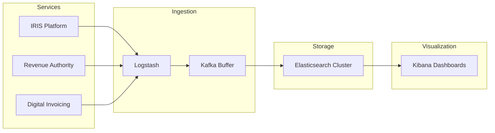

## Context

Government digital transformation platforms generate massive log volumes across dozens of microservices. Without centralized logging, debugging production issues and performing analytics becomes nearly impossible.

## Architecture

## Design Decisions

- **Elasticsearch cluster** for full-text search and aggregation at scale
- **Logstash pipelines** for log parsing, enrichment, and filtering
- **Kafka buffer** between ingestion and storage for backpressure handling
- **Index lifecycle management** for cost-effective retention of 1TB+ data

## Trade-offs

| Decision | Benefit | Cost |
|----------|---------|------|
| Centralized ELK | Single pane of glass | Initial setup complexity |
| Kafka buffer | Handles traffic spikes | Additional infrastructure |
| Hot/warm/cold tiers | Cost optimization | Query latency on cold data |

## Scalability

- Horizontal scaling of Elasticsearch nodes
- Logstash auto-scaling based on queue depth
- Partitioned Kafka topics per service domain
