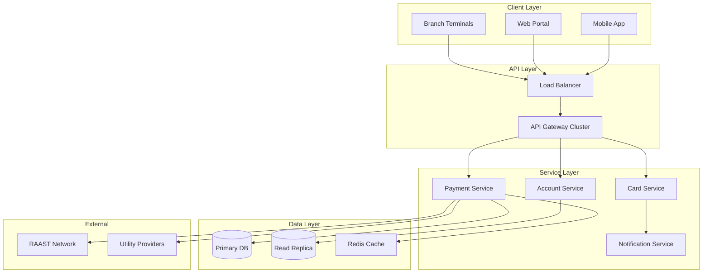

## Context

Retail banking platforms must maintain high availability across hundreds of branches, processing real-time payments through interbank networks with strict SLA requirements.

## Architecture

## Key Design Decisions

- **Active-passive database** with read replicas for query offloading
- **Redis caching** for frequently accessed account and card data
- **Circuit breakers** on external payment network integrations
- **Idempotent APIs** for safe retry of financial transactions
- **Multi-channel notifications** with fallback (push → SMS → email)

## Modules Delivered

RAAST P2P/P2M, IBFT, card management, utility payments, wallet top-up, savings pot, and personal finance management.

## Reliability Patterns

- Health checks and auto-recovery
- Graceful degradation when external services are unavailable
- Transaction logging for audit and reconciliation
- Rate limiting to protect against abuse
