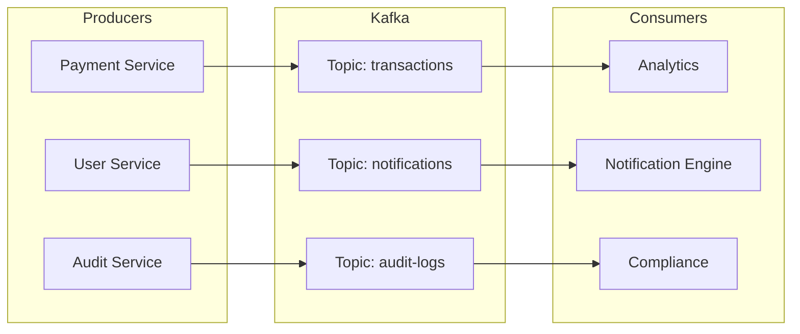

## Context

Modern enterprise systems require real-time data pipelines for transaction logging, audit trails, and inter-service communication. Kafka provides the backbone for event-driven architecture.

## Architecture

## Design Principles

- **Topic partitioning** by business domain for parallel processing
- **Consumer groups** for horizontal scaling of consumers
- **Dead letter queues** for failed message handling
- **Schema registry** for event contract evolution
- **Exactly-once semantics** for financial transaction events

## Use Cases

- Transaction event logging across banking microservices
- Real-time notification triggers (email, SMS, push)
- Audit trail compliance for government systems
- Log aggregation pipeline feeding ELK stack

## Scalability Considerations

- Partition count aligned with consumer parallelism
- Retention policies per topic based on compliance requirements
- Monitoring consumer lag as primary health metric
