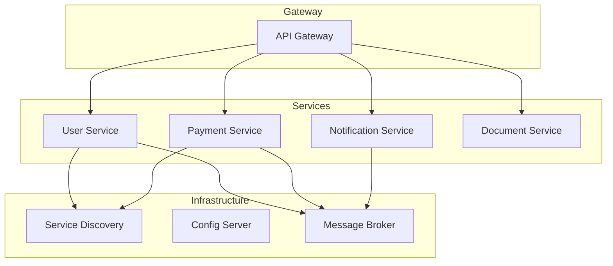

## Context

Enterprise banking systems often start as monoliths. As scale and team size grow, decomposing into microservices becomes necessary — but the migration path is fraught with pitfalls.

## Architecture

## Key Patterns

- **API Gateway** — Single entry point, routing, authentication
- **Service Discovery** — Dynamic service registration and lookup
- **Circuit Breaker** — Fault tolerance for inter-service calls
- **Saga Pattern** — Distributed transaction management
- **CQRS** — Separate read/write models for complex domains

## Real-World Example

Migrated RAAST payment monolith into separate services for ID management and transaction processing, enabling independent scaling and deployment.

## Lessons Learned

- Start with bounded contexts, not technical layers
- Invest in observability from day one
- Database-per-service prevents tight coupling
- Feign clients with fallback for resilient communication
